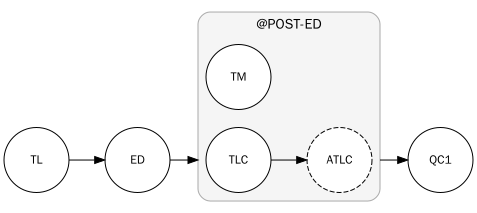

# Nino Documentation

## Getting Started

### Create a project

Use the `/project create` command to create the project. Here, you can choose a nickname for the project, its relevant
channels, and its [privacy settings](#privacy-settings). Note that many of the fields for this command are optional -
if left blank, Nino will auto-populate them with data from AniList.

### Template Staff

Once you have a project, you'll probably want to add some staff. Template Staff will automatically add tasks to new
episodes, and you have some choices when working with them. You'll need to specify an *applicator* when using Template
Staff commands:

- **All Episodes**: The operation (e.g. "add staff") will apply to all episodes in the project.
- **Incomplete Episodes**: The operation will apply to incomplete episodes. This is useful if, for example, the person
  assigned to the task is changing: the original user remains assigned to the task for the episodes they did, and the
  new person to the incomplete episodes.
- **Future Episodes**: The operation will only apply to episodes added in the future. No changes are made to existing
  episodes.

You can use `/template-staff add` to add staff to the project, or `/template-staff import` to import them.
See [importing Template Staff](#template-staff-import).

#### Important note on Template Staff

Template Staff aren't some special entity on episodes. Template Staff are essentially a one-to-many link to Tasks,
which can be created, modified, and deleted using Task commands. Template Staff are linked to tasks by their
abbreviation. Therefore, if you use a Task command to change the abbreviation of a Template Staff task for an episode,
that task will no longer be "linked". Inversely, if you use a Task command to create a task with a Template Staff
abbreviation, it will be "linked".

Furthermore, Template Staff commands act like a broadcast, and will overwrite tasks with the changes being made. For
example, if you use a Task command to change the assigned user for an episode, then use a Template Staff command to
change the assigned user for all episodes, the Task command's change will be overwritten. Just something to keep in
mind!

### Tasks

Tasks are the backbone of the system. Task commands can work on a single episode or a range of episodes. You can use
`/task add` to add tasks, or `/task import` to import them. See [importing tasks](#task-import).

> **Recomendation**: Set task names to `-ing` verbs, as they look the best in status embeds.

#### Pseudotasks

Sometimes you want a task (especially for use with the [Conga graph](#conga)) that you don't want publically displayed
in progress embeds, etc. For example, an "apply QC" task. Pseudotasks will not be displayed in `/blame` or trigger
progress updates, but they are valid Conga targets.

### Conga

Nino has a very comprehensive task dependency system, here called the "Conga graph", an artifact from a simpler time
when there was just a single "conga line" of tasks - one entry point, one exit point.

When the Conga graph is in use, tasks will @mention downstream tasks upon completion. For example, if `ED` depends on
`TL`'s completion, you can add `TL -> ED` to the graph, and `ED`'s assignee will be @mention'd when `TL` completes.
Tasks can have multiple dependants, where all dependents will be pinged, and multiple prerequisites, where the
task won't be pinged until all prerequisites are complete.

Another powerful feature is Groups. Conga Groups are intended for parallel workflows, but they can also be used for
categorization. Just note that groups can't be nested.



In this example, the completion of `ED` will ping *both* `TLC` and `TM`. If `TM` completes before `TLC`,
then `TLC` will be re-pinged. `TLC` has a dependant task, `ATLC`, so when `TLC` completes, `ATLC` will be pinged. If
`TLC`'s entire subtree completed before `TM`, then `TM` would be re-pinged. This behavior works with as many group
members as you need. When all members of the group are complete, any tasks downstream of the group (`QC1` in the
example) will be pinged.

Conga commands include `/conga edge add`, `/conga group create`, and `/conga group add-member`. Additionally, you can
[import a Conga graph](#conga-import).

> **Note**: To use the `$AIR` special node, episode air notifications need to be enabled.

### Privacy Settings

A project can be either public or private. A private project is designed to be
less visible to users who are not working on it.

1. Private projects will not appear in autocomplete suggestions (e.g., when
   typing [`/blame`](#blame) or [`/done`](#done)) for users who are not involved
   with the project.
2. Users cannot [observe](#observer-add) the project unless they are a member of
   the project staff or an administrator. Note that if the project used to be
   public, any existing observers will continue to function unless the updates
   are disabled via `/group edit publish-private-progress`.
3. By default, Nino will still post progress updates for private projects to the
   configured update channel. However, there is the option to disable these
   updates globally for the group with `/group edit publish-private-progress`.

> **Info**: If you are coming from Deschtimes and have been using its Joint feature to relay progress updates and use
> /blame in another server, see the section for [Adding an Observer](#observer-add).

## Importing

Discord slash commands can be quite limiting, so Conga, Tasks, and Template Staff all have import commands for loading
data from a file.

### Conga Import

Conga graphs can be imported using `/conga import`. Link nodes with `A -> B`, and add group nodes with `@Group + C`:

```
$AIR -> TL
TL -> ED
ED -> @POST-ED
@POST-ED -> QC

@POST-ED + TM
@POST-ED + TLC

TLC -> ATLC
```

A couple things to note:

- `/conga import` *replaces* the existing graph.
- Group members can only be added after the group is created.
- Group sub-trees can only be added after the root task is added to the group.

### Task Import

Tasks can be imported by supplying `/task import` a `jsonl`-formatted file. `jsonl` ("json lines") is a file containing
one complete entry per line:

```json lines
{ "Abbreviation": "TEST1", "Name": "Test 1", "Assignee": { "DiscordId": 12345 }, "IsPseudo": false, "First": "2" }
{ "Abbreviation": "TEST2", "Name": "Test 2", "Assignee": { "DiscordId": 67890 }, "IsPseudo": true, "First": "3", "Last": "6", "Weight": -10.5 }
```

- The `Last` episode and `Weight` fields are optional.

### Template Staff import

Template Staff can be imported by supplying `/template-staff import` a `jsonl`-formatted file. `jsonl` ("json lines")
is a file containing one complete entry per line:

```json lines
{ "Applicator": "AllEpisodes", "Abbreviation": "TEST3", "Name": "Test 3", "Assignee": { "DiscordId": 12345 }, "IsPseudo": false }
{ "Applicator": "IncompleteEpisodes", "Abbreviation": "TEST4", "Name": "Test 4", "Assignee": { "DiscordId": 67890 }, "IsPseudo": false, "Weight": -10.5 }
```

- The `Weight` field is optional.
- `Applicator` may be `AllEpisodes`, `IncompleteEpisodes`, or `FutureEpisodes`.
